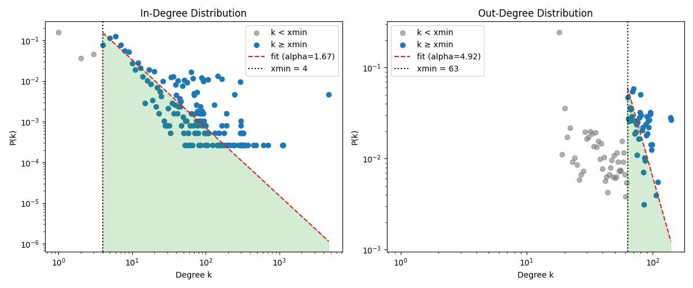
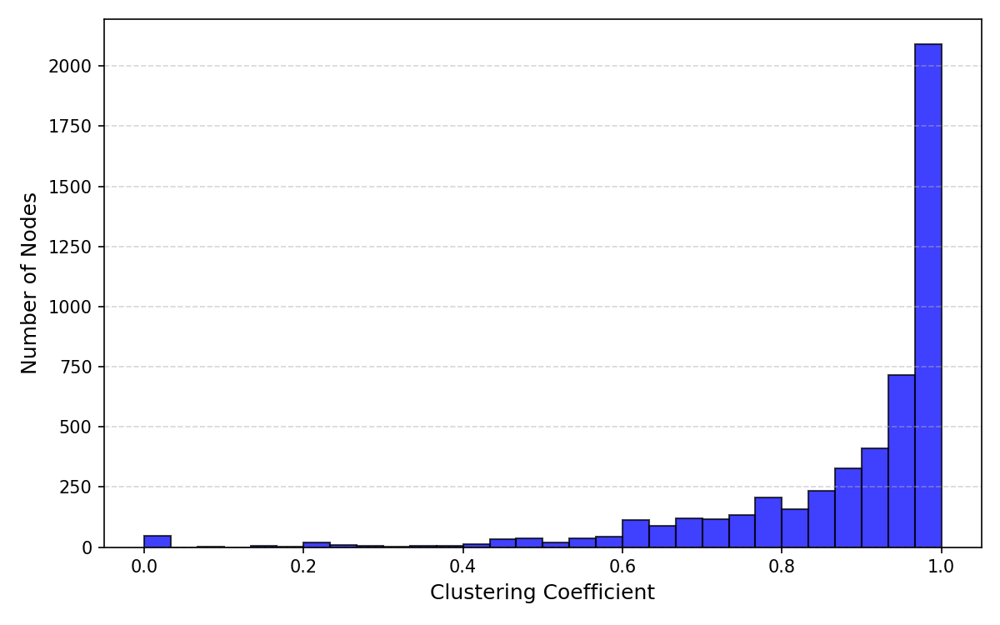
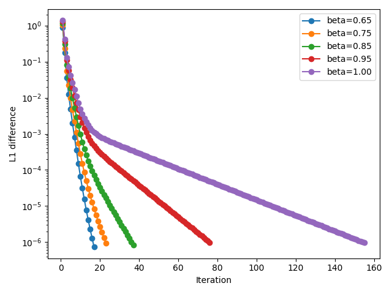

# 🕸️ Web Graph Crawler

Web Graph Crawler is a high-performance, multi-threaded toolkit for web data 
collection and graph analysis. It fetches web pages, constructs a directed graph 
of hyperlinks and executes advanced network analyses including PageRank 
computation, robustness testing and performance evaluation.

### 🪨 Architecture

The system follows a modular design:

- **crawler** (`src/crawler`): multi-threaded web crawler that extracts 
hyperlinks and persists raw pages
- **graph** (`src/graph`): utilities for graph creation and metrics calculation
using NetworkX
- **experiments** (`src/experiments`): analytical workflows
  - `analysis_exp`: core graph statistics
  - `performance_exp`: crawler performance analysis
  - `robustness_exp`: graph resilience evaluation via node removal strategies
  - `pagerank_exp`: iterative PageRank algorithm
- **common** (`src/common`): shared components like configuration and logging
- **CLI** (`src/main.py`): command-line interface

### 🚀 Installation

```bash
git clone https://github.com/tommikulevich/web-graph-crawler
cd web-graph-crawler
pip install -r requirements.txt
```

### 📜 Configuration

Customize analysis and crawler parameters in `configs/config.yaml`. For example:

```yaml
crawler:
  base_url: "http://example.com/"
  max_pages: 4000
  threads_num: 16
  timeout_s: 3
  user_agent: "WebGraphCrawler/1.0"
  storage_path: "data/storage"

analysis:
  reports_path: "data/reports"

pagerank:
  damping_factor: 0.85
  max_iterations: 100
  tol: 1e-6
```

### ♻️ Usage

Run the crawler to collect pages:

```bash
python src/main.py crawl -c configs/config.yaml
```

Perform full analysis and generate reports based on collected connections:

```bash
python src/main.py analyze -c configs/config.yaml
```

### 📊 Example Visualizations

#### Graph Vertex Degree Distribution

> Log-log plot: red line is a matched power model (see *Power law*) using MLE method.



#### Clustering Histogram



#### Convergence of PageRank Algorithm

> Semilog plot: illustrates how the L¹‐difference of the PageRank vector decreases over iterations for various damping factors.


